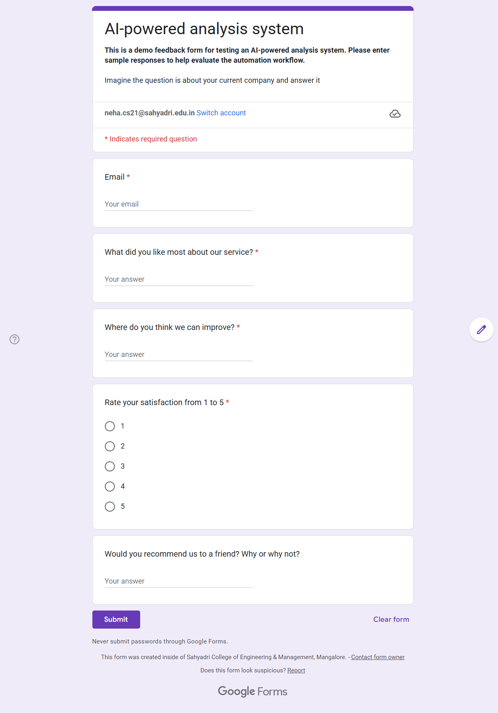
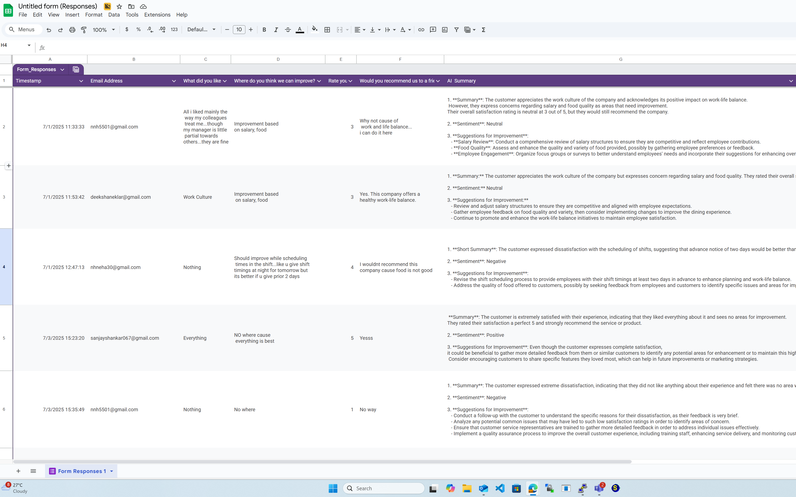
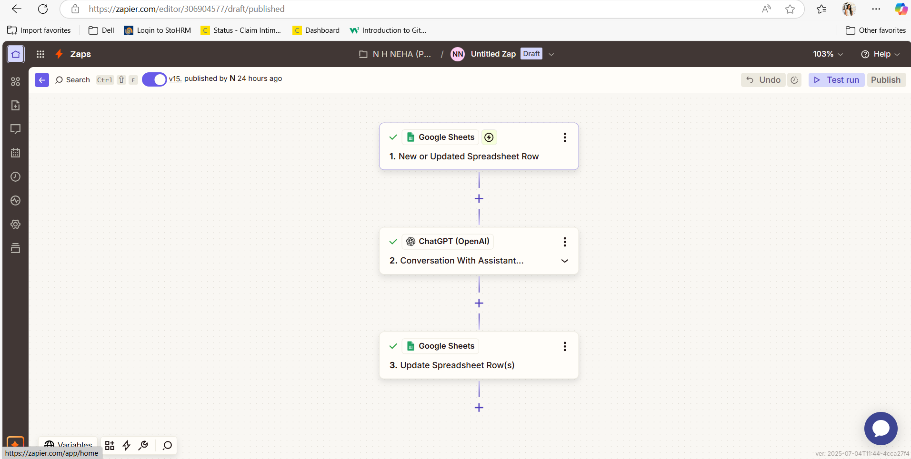

# 🧠 AI Feedback Analyzer

An AI-powered customer feedback analyzer that automatically summarizes responses from Google Forms using ChatGPT via Zapier. Built with no-code tools like Google Sheets and OpenAI — no manual work needed!

---

## 🚀 Features

- 📋 Collects customer feedback through Google Forms
- 📊 Sends responses to Google Sheets automatically
- 🤖 Uses ChatGPT (via Zapier) to:
  - Generate a **summary**
  - Detect **sentiment**
  - Suggest **improvements**
- ✨ Updates the sheet with AI-generated insights in real time

---

## 🛠️ Tools Used

- [Google Forms](https://forms.google.com) – to collect feedback
- [Google Sheets](https://sheets.google.com) – to store responses
- [Zapier](https://zapier.com) – to automate the workflow
- [ChatGPT (OpenAI)](https://platform.openai.com) – to generate summaries

---

## 🖼️ Screenshots

| Google Form | Google Sheet | Zapier Workflow |
|-------------|--------------|------------------|
|  |  |  |

---

## 🔧 How It Works

1. **Customer fills out Google Form**
2. **Zapier triggers when a new row is added in the Google Sheet**
3. **ChatGPT generates a summary, sentiment, and suggestions**
4. **Zapier updates the same row in the Sheet with AI response**

---

## 📁 Project Structure

ai-feedback-analyzer/
│
├── README.md ✅ Project overview and setup instructions
├── screenshots/ 📸 Screenshots of the form, sheet, Zapier steps
│ ├── form.png
│ ├── sheet-output.png
│ └── zapier-flow.png
├── prompt-template.txt 💬 AI prompt used in Zapier

## 📂 Sample Feedback File

A sample-feedback.csv is provided in the repo to demonstrate real form input and AI-generated summaries.

📝 **[Try the Live Feedback Form]** (https://forms.gle/e3es8yS9iQviXvFaA)
